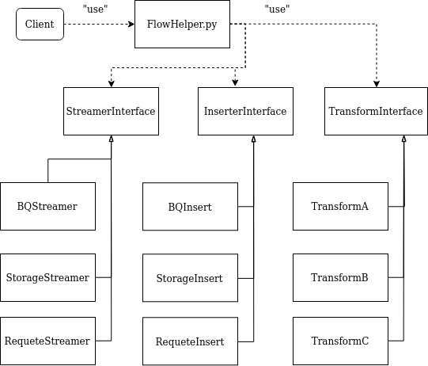
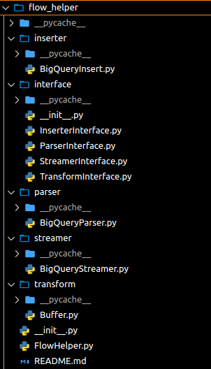
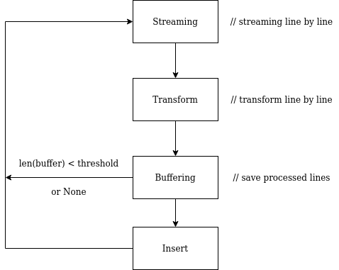

# Flow Helper

## Introduction
This class, also know as Le dataflow du pauvre, is used to help to manage the flow of datas (Streaming => Processing => Inserting)

## UML


## Architecture project 


## How to use it
Take a look at this pseudo-code below:
```python
# application_main.py
flow_helper = FlowHelper(source_stream, dest_insert)
flow_helper.config(config_obj_from_config_file)
flow_helper + [transformA, transformB, ...]
flow_helper.run() 
```
- source_stream, dest_insert: string 
  - crested-epoch:dataset_id.table_id
  - gcp://bucket
  - query.sql
  - etc
- config_obj_from_config_file: dictionary from a configuration file *.cfg* which is defined by user in the application

## How flow_helper works
Firstly, we need to understand how **flow_helper** initializes the Streamer/Inserter via *source_stream*, *dest_insert*. To do that, **flow_helper** uses this function below:
```python
def __parse_arg(self, stream: str, insert: str) -> object:
    """Initialize the streaming object and the inserting object based on the arguments
    
    Args:
        stream (str): string that specify the streaming object
        insert (str): string that specify the inserting object
    
    Returns:
        object: streaming object and inserting object

    TODO: For now, this function is very simple because we just have BigQueryStream/Insert.
    But, in the future, we could have, for ex, GoogleStorageStream/Insert, so at that time, 
    we would improve this function to help us determine precisely which is the stream/insert 
    object based on the string arguments.
    """
    bqparser = BigQueryParser(stream_source=stream, insert_source=insert)
    return bqparser.create_stream_object(), bqparser.create_insert_object()
```
The idea is very simple, *__parse_arg()* helps us reponse two questions: 
1. The streaming source is a BQTable or GoogleStorage or ... ?
2. The inserting source is a BQTable or GoogleStorage or ... ?

Then, thanks to the child class, like *BigQueryParser()*, which inherits from **ParserInterface** class, *__parse_arg()* will create the Streamer/Inserter objects correctly.

Secondly, how does the configuration file, defined in the application, look like? Take a look at this *.cfg* example:
```INI
[streaming-object]
index_start=0
index_end=1000
nb_thread=5
[inserting-object]

[buffer]
size=5000
[application]
```
If the configuration isn't exist, **flow_helper** will use the default values. And by the convention, the location of this file is in *app/src/config/*.

Next, what does ```flow_helper + [transformA, transformB, ...]``` actually mean? In fact, it'll add a list of processes into **flow_helper**. Behind the scene, **flow_helper** handles multi processes (multi transformations) via a queue of processes (see the code below).
```python
def __process(self, row: List) -> List:
    """Handle data with queue of processes
    
    Args:
        row (List): list with one row data need to be handled
    
    Returns:
        List: processed data
    """
    for transform in self.__list_transforms:
        row = transform.transform_data(row)
    return row
```

Finally, combine all these stuffs above, we have the main process:
```python
def run(self) -> None:
    """Stream, processing and insert

    Args:
        processing_object: Object with a process function that can do something with batches of data

    Warnings:
        - the processing object must implement TransformInterface

    """
    if self.__config:
        self.__set_options()
    stream_generator = self.__streaming_object.stream_generator()
    try:
        while True:
            row = next(stream_generator)  # -> [dict]
            processed_row = self.__process(row)
            self.__inserting_object.insert_in_(processed_row)
    except StopIteration as si:
        ele_flushed = self.__flush_all()
        self.__inserting_object.final_insert_in_(ele_flushed)
```

## For further

# Content Parsing
## Introduction
This application is used to help us to insert the data extracted, from BQTable, in the BQTable

## Workflow
